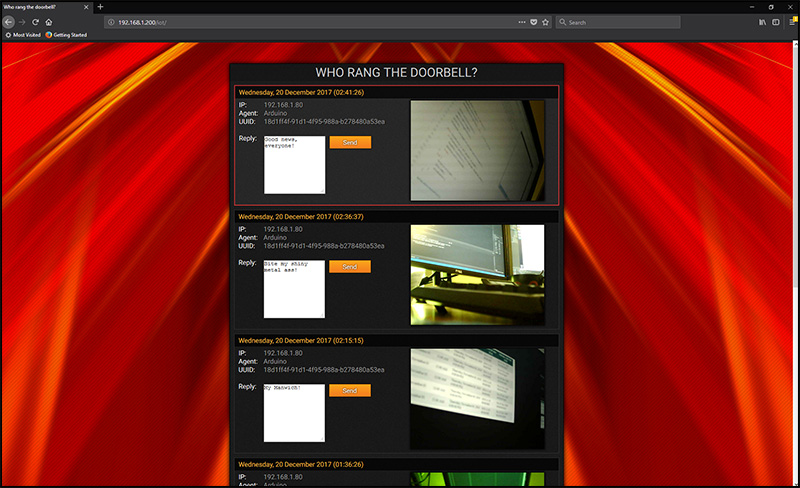

# HSLU HS17 AITEC - IoT Task
Here you can find all the code for the Advanced Internet Technologies (AITEC) Arduino "IoT" Task. 

  
## Getting started
You can simple copy the code from the *.ino-Files into your Arduino-IDE or download the whole thing and open the solution "ArduinoTests.sln" with Visual Studio 2017.  
Make sure you have installed Visual Studio with C++ support and the Arduino IDE-Plugin by Visual Micro. You can download the plugin here: http://www.visualmicro.com/  
 
**Test**-Folder includes following codes for testing and evaluation:  
- [x] [**Fading LED**](Tests/FadingLED/FadingLED.ino) _(2017.12.05)_
- [x] [**LinkspriteTest**](Tests/LinkspriteTest/LinkspriteTest.ino) _(2018.07.14)_
- [x] [**PingTest (with modified library)**](Tests/PingTest/PingTest.ino) _(2017.12.07)_
- [x] [**PushImageToServerTest**](Tests/PushImageToServerTest/PushImageToServerTest.ino) _(2017.12.08)_
- [x] [**PushTest**](Tests/PushTest/PushTest.ino) _(2017.12.08)_
- [x] [**SDCardImageToSerial**](Tests/SDCardImageToSerial/SDCardImageToSerial.ino) _(2017.12.08)_
- [x] [**SDCardInitTest**](Tests/SDCardInitTest/SDCardInitTest.ino) _(2017.12.06)_
- [x] [**SDCardReadWriteTest**](Tests/SDCardReadWriteTest/SDCardReadWriteTest.ino) _(2017.12.06)_
- [x] [**WebClientTest**](Tests/WebClientTest/WebClientTest.ino) _(2017.12.07)_
- [x] [**WebServerTest**](Tests/WebServerTest/WebServerTest.ino) _(2017.12.08)_

_(Checkbox is marked if test was successful)_ 

**Main**-Folder includes the final "DoorBell"-IoT-Project:  
- [**Arduino Code**](DoorBell/Main/Main.ino)
- [**Web Code**](DoorBell/Web)

 
**Function:** Push a button (Doorbell) and upload a snapshot (Camera) to a server (Web). User can see who rang the bell and write a short message back to the Arduino, which shows the message with the help of a display to the visitor. 

## Notes
### Ethernet-Module
There are two versions of the Ethernet-Shield. One with the W5100 chipset and another with the W5500 chipset. 
You **can't** use the same "Ethernet"-Library for both versions!  
- With Arduino Ethernet Shield (Wiznet W5100 chipset): 
Use `#include <Ethernet.h>`
- With Arduino Ethernet Shield 2 (Wiznet W5500 chipset): 
Use `#include <Ethernet2.h>`

Maybe you have to add the Ethernet2-Library manually to your project. Get it from [**here**](https://github.com/adafruit/Ethernet2).